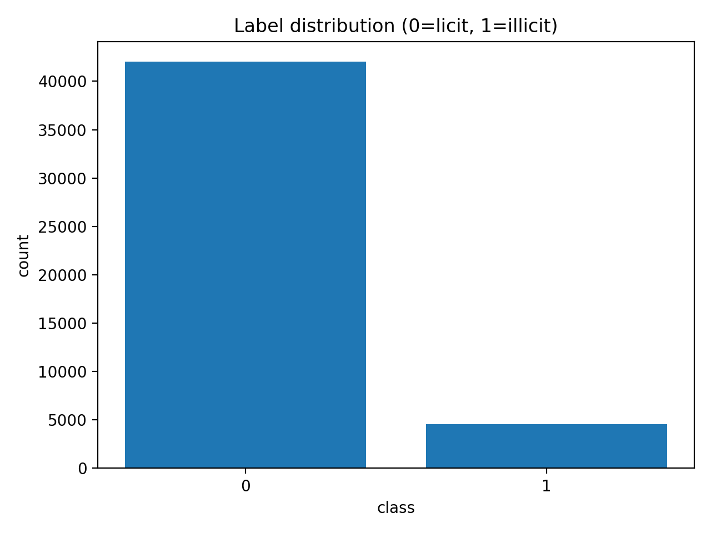
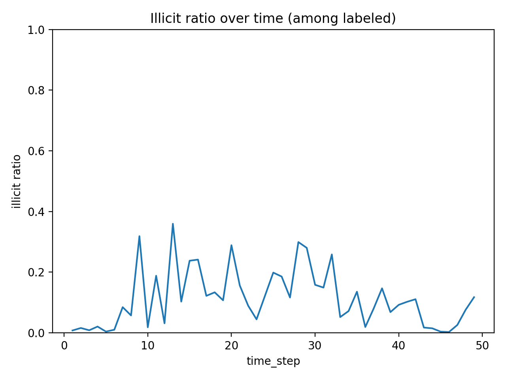
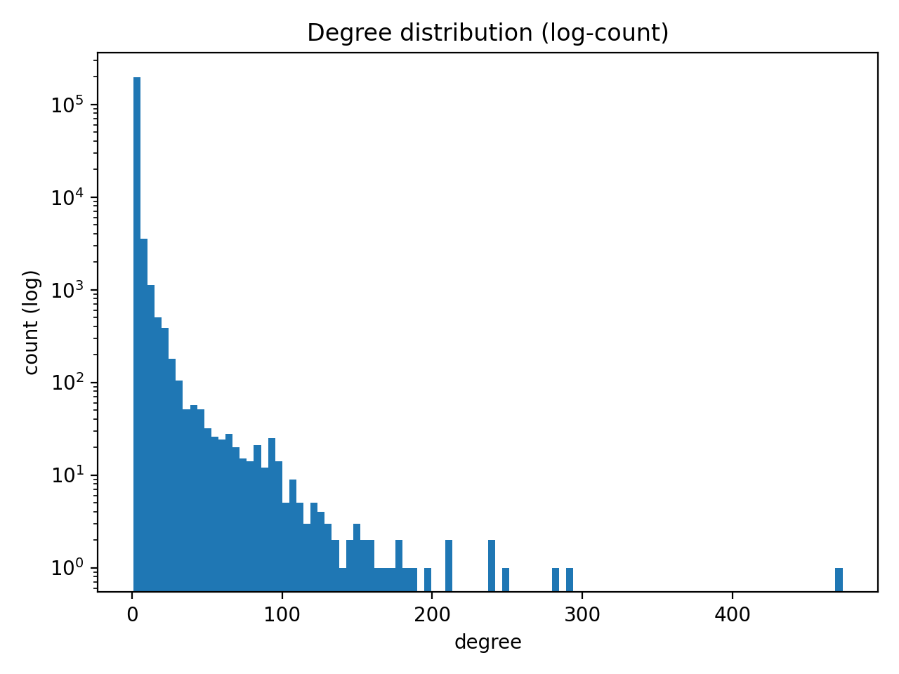
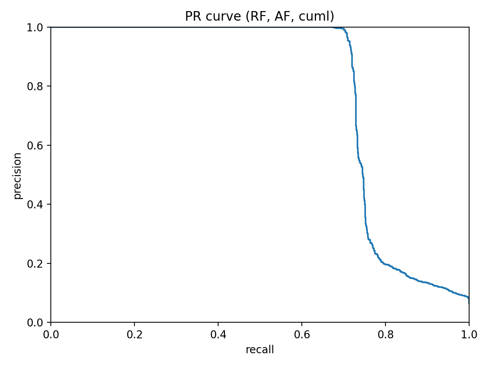
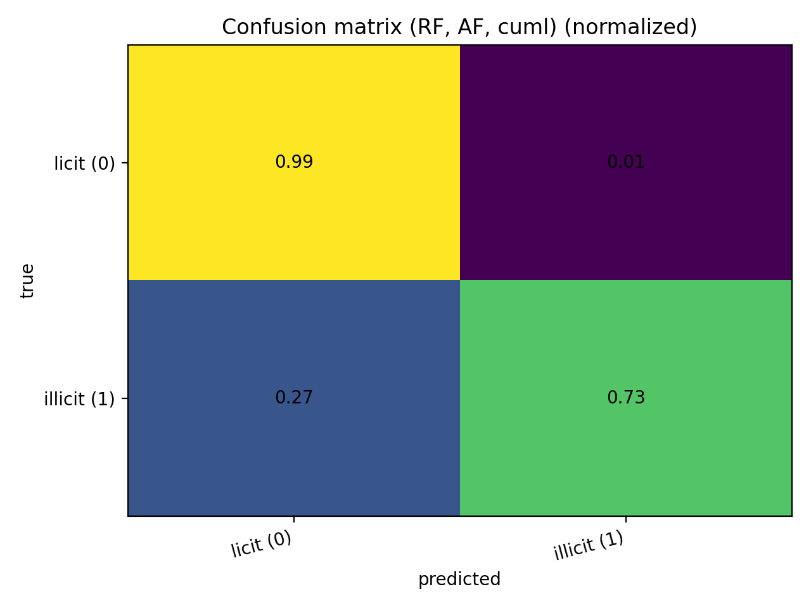

# AML on the Elliptic Bitcoin Transaction Graph (Tabular + GCN/SkipGCN)

End-to-end experimental pipeline for illicit transaction detection on the Elliptic transaction graph:
- Tabular baselines (LogReg / Random Forest) with optional RAPIDS cuML acceleration
- Graph models (GCN, SkipGCN)
- Optional embedding augmentation: Random Forest on (tabular features ⊕ learned GNN embeddings)
- Reproducible phase logs + JSON metrics + scientific phase reports

> Dataset context: the Elliptic Bitcoin dataset is a temporal graph of Bitcoin transactions with engineered node features and licit/illicit labels.

---

## Repository structure

- `src/` — full pipeline code (phases 1–5)
- `reports/` — scientific write-ups per phase
- `notebooks/` — final report notebook
- `results/metrics/` — **tracked** JSON metrics (small, reviewable)
- `assets/figures/` — **tracked** curated figures used in this README
- `data/` + `results/` (artifacts) — **not tracked** (see `.gitignore`)

---

## Data

Place the Elliptic raw CSVs here (not committed):

```
data/raw/
elliptic_txs_features.csv
elliptic_txs_edgelist.csv
elliptic_txs_classes.csv
```


A common source is Kaggle’s “Elliptic Data Set”.

---

## Environments (GPU vs CPU)

This repo supports two GPU stacks that do not always align on the same CUDA version:

1) **PyTorch + PyG (GNN stack)**  
   PyTorch Geometric provides wheels for specific CUDA builds (e.g., `cu128`, `cu129`, etc.). 
   Use `requirements.lock.txt` for a pinned pip environment (includes CUDA 12.8 runtime wheels via `nvidia-*` packages).

2) **RAPIDS cuML (tabular acceleration)**  
   cuML is supported on Linux/WSL2; installation and CUDA compatibility are driven by RAPIDS releases.
   The provided `environment_gpu.yml` is a RAPIDS-focused environment.

### Recommended setups
- **Reproducible (single env):** use PyTorch/PyG + sklearn tabular (no cuML).  
- **Fast tabular:** use RAPIDS/cuML for tabular phases; if you want *both* cuML and PyG GPU in one env, align CUDA versions (see RAPIDS install guidance).

---

## Quickstart (reproducible, minimal friction)

### A) Pinned pip env (PyTorch GPU + sklearn tabular)
```bash
python -m venv .venv
# activate venv...
pip install -r requirements.lock.txt
```

Run the full pipeline on GPU if available (tabular backend = sklearn):

```bash
python -m src.main --phase all --device auto --tabular-backend sklearn
```

### B) RAPIDS env (tabular cuML acceleration)
```bash
conda env create -f environment_gpu.yml
conda activate aml-elliptic-gpu
pip install -r requirements_core.txt
```
Run tabular phases with cuML:

```bash
python -m src.main --phase 3 --device cpu --tabular-backend cuml
python -m src.main --phase 4 --device cpu --tabular-backend cuml
python -m src.main --phase 5 --device cpu --tabular-backend cuml
```
> Note: running GNN phases requires torch + torch-geometric installed and CUDA compatibility handled.

---

### How to run (phases)

All phases are orchestrated via `src/main.py`:

```bash
# Phase 1: preprocessing
python -m src.main --phase 1

# Phase 2: EDA (+ plots)
python -m src.main --phase 2

# Phase 3: baselines + GNN training
python -m src.main --phase 3

# Phase 4: tuning + threshold selection
python -m src.main --phase 4

# Phase 5: final evaluation + inference demo
python -m src.main --phase 5
```
Useful flags:
- `--device auto|cpu|cuda|cuda:0` (sets `AML_DEVICE`)
- `--tabular-backend sklearn|cuml|auto` (sets `AML_TABULAR_BACKEND`)
- `--fast` (sets `AML_FAST=1`, reduces tuning/training budgets)

---

### Results
**Main Phase05 evaluation summary (tracked figure)**

This plot corresponds to the Phase05 evaluation artifacts produced by the pipeline.

**Best achieved metrics (from tracked JSONs)**

Evaluation protocol: temporal split with train steps 1–34 and test steps 35–49; metrics are reported on **labeled** nodes in the test window.

| Model                               | Feature mode | Precision (illicit) | Recall (illicit) | F1 (illicit) | Source                              |
| ----------------------------------- | -----------: | ------------------: | ---------------: | -----------: | ----------------------------------- |
| Random Forest (tabular)             |           AF |              0.8992 |           0.7248 |   **0.8027** | `results/metrics/baselines_AF.json` |
| Random Forest (tabular)             |           LF |              0.8879 |           0.7018 |       0.7839 | `results/metrics/baselines_LF.json` |
| RF on GCN embeddings (augmentation) |           AF |              0.9929 |           0.6445 |       0.7816 | `results/metrics/gnn_AF.json`       |
| GCN                                 |           AF |              0.5069 |           0.5115 |       0.5092 | `results/metrics/gnn_AF.json`       |
| SkipGCN                             |           AF |              0.4729 |           0.5789 |       0.5205 | `results/metrics/gnn_AF.json`       |


---

### Exploratory Data Analysis highlights (curated)

Class imbalance:
<p align="center">
  
</p>
Illicit ratio over time:
<p align="center">
  
</p>
Heavy-tailed degree distribution:
<p align="center">
  
</p>


### Model diagnostics (curated)

Precision–Recall for the Phase04 RF (AF, cuML):
<p align="center">
  
</p>
Normalized confusion matrix:
<p align="center">
  
</p>
---

### Reports and notebook

Scientific phase reports: `reports/phase01_preprocessing.md` … `reports/phase05_evaluation.md`
Final notebook: `notebooks/AML_Elliptic_Final_Report.ipynb`

---

If you build on this work, cite the original [Elliptic dataset](https://www.kaggle.com/datasets/ellipticco/elliptic-data-set) / [AML-GCN paper](https://jiechenjiechen.github.io/pub/aml_gcn.pdf) and (optionally) this [repo](https://github.com/Amir0234-afk/aml-elliptic).


[](LICENSE)


